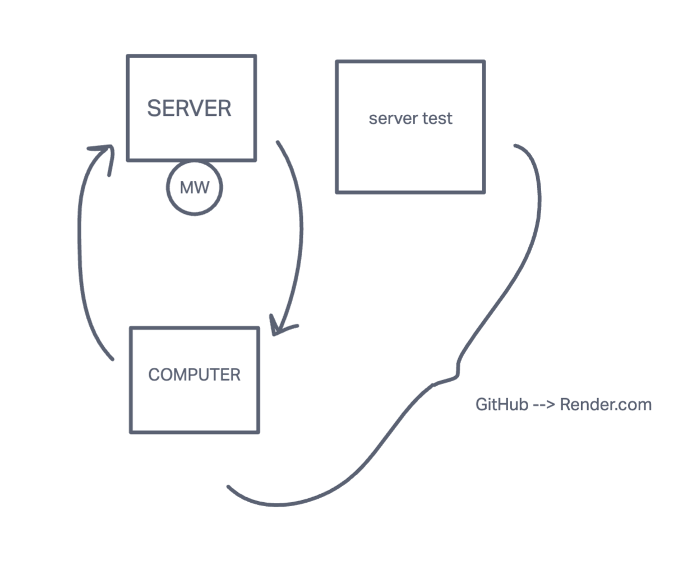

# basic-express-server

## Author: Emily Greason

## Setup

### .env requirements

- PORT = 3000

### Running the app

- npm start

- Endpoint /person

  - Returns Object

    { name: 'name' }

### UML

